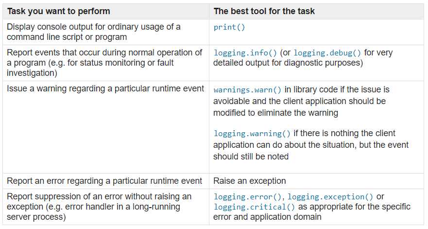

# Python для сетевых инженеров 

---
## Welcome to продленка :)

---

## Модуль logging


---
### Базовый пример

+++?code=code/logging_basic_1.py&lang=python&title=logging_basic_1.py

@[1]
@[3]
@[5-7]

+++
### Log-файл

```
DEBUG:root:Сообщение уровня debug
INFO:root:Сообщение уровня info
WARNING:root:Сообщение уровня warning
```

+++?code=code/logging_basic_2.py&lang=python&title=logging_basic_2.py

@[1]
@[3]
@[5-7]
@[1-7]

+++
### Log-файл

```
DEBUG:root:Сообщение уровня debug:
{'__name__': '__main__', '__doc__': None, '__package__': None, '__loader__': <_frozen_importlib_external.SourceFileLoader object at 0xb72a57ac>, '__spec__': None, '__annotations__': {}, '__builtins__': <module 'builtins' (built-in)>, '__file__': 'logging_basic_2.py', '__cached__': None, 'logging': <module 'logging' from '/usr/local/lib/python3.6/logging/__init__.py'>}
INFO:root:Сообщение уровня info
WARNING:root:Сообщение уровня warning
```

---
### Рекомендации

+++
### Когда использовать модуль logging



+++
### Уровни


---
### Компоненты модуля logging

* Logger - это основной интерфейс для работы с модулем
* Handler - отправляет log-сообщения конкретному получателю
* Filter - позволяет фильтровать сообщения
* Formatter - указывает формат сообщения

---
### Вывод на стандартный поток ошибок

+++?code=code/logging_api_example_1.py&lang=python&title=logging_api_example_1.py

@[1]
@[3]
@[5-8]
@[1-8]

+++
### Результат выполнения

```
$ python logging_api_example_1.py
Сообщение уровня warning
```

По умолчанию вывод идет в stderr и уровень warning.

+++?code=code/logging_api_example_2.py&lang=python&title=logging_api_example_2.py

@[1]
@[3-4]
@[6-7]
@[8-10]([LogRecord attributes](https://docs.python.org/3.6/library/logging.html#logrecord-attributes), [time.strftime](https://docs.python.org/3.6/library/time.html#time.strftime))
@[6-10]
@[3-4,12]
@[14-17]
@[1-17]

+++
### Результат выполнения

```
$ python logging_api_example_2.py
16:39:27 - My Script - DEBUG - Сообщение уровня debug: SOS
16:39:27 - My Script - INFO - Сообщение уровня info
16:39:27 - My Script - WARNING - Сообщение уровня warning
```

+++
### Вывод на стандартный поток вывода

+++?code=code/logging_api_example_2_stdout.py&lang=python&title=logging_api_example_2_stdout.py


+++?code=code/logging_api_example_2_new_format.py&lang=python&title=logging_api_example_2_new_format.py

@[1]
@[3-4]
@[6-7]
@[8-10]
@[6-10]
@[3-4,12]
@[14-17]
@[1-17]

+++
### Результат выполнения

```
$ python logging_api_example_2.py
16:45:20 - My Script - DEBUG - Сообщение уровня debug: SOS
16:45:20 - My Script - INFO - Сообщение уровня info
16:45:20 - My Script - WARNING - Сообщение уровня warning
```

---
### Запись логов в файл

+++?code=code/logging_api_example_3.py&lang=python&title=logging_api_example_3.py

@[1]
@[3-4]
@[6-7]
@[8-10]
@[6-10]
@[3-4,12]
@[14-17]
@[1-17]


+++
### Результат выполнения

Файл logfile.log
```
17:58:34 - My Script - WARNING - Сообщение уровня warning
```

---
### Запись в файл и вывод на stderr

+++?code=code/logging_api_example_4.py&lang=python&title=logging_api_example_4.py

@[1-4]
@[6-13]
@[15-22]
@[1-28]


---
### Handlers

+++
### RotatingFileHandler

+++?code=code/logging_api_example_5_file_rotation.py&lang=python&title=logging_api_example_5_file_rotation.py

@[2,7-8]
@[1-20]

+++
### Результат выполнения

```
$ ls -1 logfile_with_rotation*
logfile_with_rotation.log
logfile_with_rotation.log.1
logfile_with_rotation.log.2
logfile_with_rotation.log.3
```

logfile_with_rotation.log - это самый свежий файл, затем идет logfile_with_rotation.log.1, logfile_with_rotation.log.2 и тд.


---
### Logging tree

+++?code=code/netmiko_func.py&lang=python&title=netmiko_func.py

+++?code=code/logging_api_example_6_mult_files.py&lang=python&title=logging_api_example_6_mult_files.py

+++
### Результат выполнения

```
$ python logging_api_example_6_mult_files.py
19:16:44 - superscript - DEBUG - Before function
19:16:50 - superscript.netfunc - DEBUG - Вывод команды:
Interface                  IP-Address      OK? Method Status                Protocol
Ethernet0/0                192.168.100.1   YES NVRAM  up                    up
Ethernet0/1                192.168.200.1   YES NVRAM  up                    up
Ethernet0/2                190.16.200.1    YES NVRAM  up                    up
Ethernet0/3                192.168.230.1   YES NVRAM  administratively down down
Ethernet0/3.100            10.100.0.1      YES NVRAM  administratively down down
Ethernet0/3.200            10.200.0.1      YES NVRAM  administratively down down
Ethernet0/3.300            10.30.0.1       YES NVRAM  administratively down down
Loopback0                  10.1.1.2        YES manual up                    up
19:16:50 - superscript - DEBUG - After function
```


---
### logger.exception

+++?code=code/logging_api_example_7_exception.py&lang=python&title=logging_api_example_7_exception.py

+++
### Результат выполнения

```
$ python logging_api_example_7_exception.py
19:23:24 - superscript - DEBUG - Before exception
19:23:24 - superscript - ERROR - Error
Traceback (most recent call last):
  File "logging_api_example_7_exception.py", line 17, in <module>
    2 + 'test'
TypeError: unsupported operand type(s) for +: 'int' and 'str'
19:23:24 - superscript - DEBUG - After exception
```

---
### Конфигурация logging из словаря

+++?code=code/logging_api_example_8.py&lang=python&title=logging_api_example_8.py

+++?code=code/logging_api_example_8_yaml_cfg.py&lang=python&title=logging_api_example_8_yaml_cfg.py

+++
### Результат выполнения

```
$ python logging_api_example_8_yaml_cfg.py
2018-02-17 19:50:56,266 - superscript - DEBUG - Сообщение уровня debug SOS
2018-02-17 19:50:56,266 - superscript - INFO - Сообщение уровня info
2018-02-17 19:50:56,266 - superscript - WARNING - Сообщение уровня warning
```

